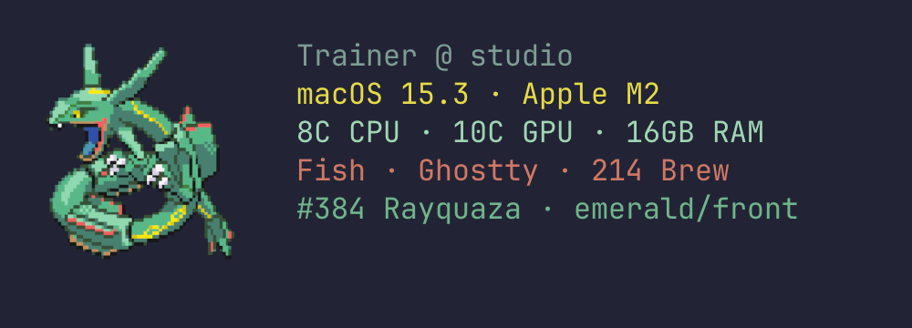
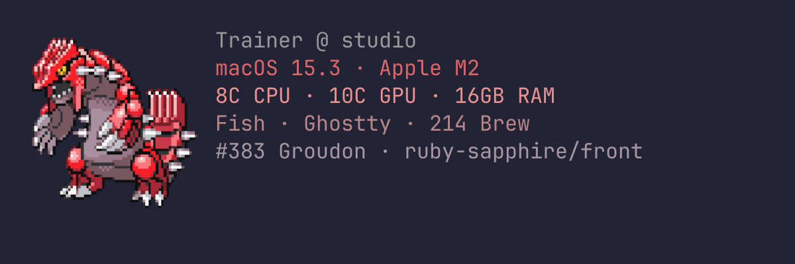
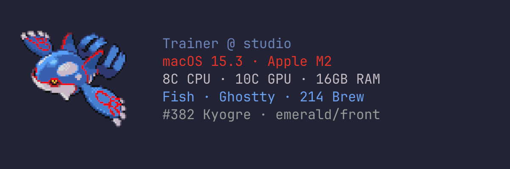
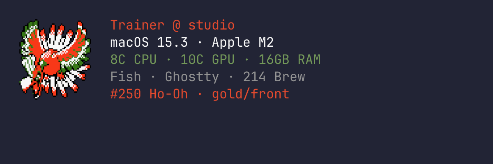
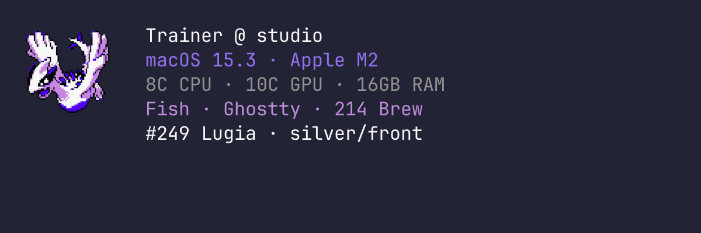
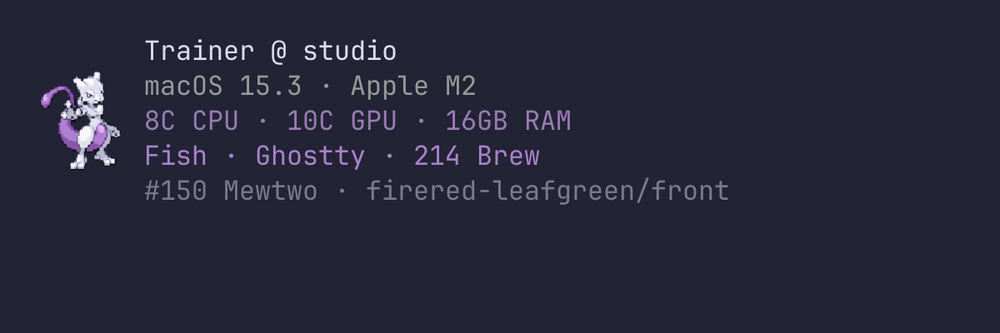

# Pokefetch

Pokefetch is a fast terminal greeting that draws a Pokemon sprite beside your
machine details and colors the text from that sprite's own palette. It can also
prepare a matching macOS dock icon for Ghostty.



The example above uses `game = "emerald"`, `size = 8`,
`alignment = "center"`, and `gap = 2`.

## Install

### Download the offline binary

Release binaries are published on the
[GitHub releases page](https://github.com/wilks7/pokefetch/releases). Download
the archive whose name ends in `retro-master.tar.gz`, unpack it, then install
the executable somewhere on your `PATH`. If no release is published for your
target yet, use the source build below.

```sh
install -d ~/.local/bin
install -m 0755 pokefetch ~/.local/bin/pokefetch
```

Release binaries contain the complete `retro-master` sprite bundle, so normal
greetings do not need the network. Confirm the installed bundle with:

```sh
pokefetch bundle
# retro-master
```

### Build from source

Clone the repository, then choose one build. The smallest binary downloads and
caches sprites as needed:

```sh
git clone https://github.com/wilks7/pokefetch
cd pokefetch
cargo install --path . --root ~/.local --locked
```

For the same fully offline bundle used by releases:

```sh
POKEFETCH_BUNDLE=retro-master \
  cargo install --path . --root ~/.local --locked --features bundle-assets
```

You can compile a smaller custom bundle by changing the profile:

```sh
POKEFETCH_BUNDLE=crystal-full \
  cargo install --path . --root ~/.local --locked --features bundle-assets
```

See [Assets and distribution](docs/assets-and-distribution.md#building-a-bundle)
for every bundle profile and how bundle contents are selected.

## Start using it

```sh
pokefetch                                      # random greeting
pokefetch --game emerald show rayquaza        # choose one sprite
pokefetch --game crystal --size 5 show lugia  # override the layout
```

Bare `pokefetch` is the same as `pokefetch greet`. To show a greeting whenever
your shell starts, follow the [shell integration guide](shell/README.md).

Configuration is optional. A small
`~/.config/pokefetch/config.toml` might look like this:

```toml
[sprites]
game = ["gold", "silver", "crystal"]
range_start = 1
range_end = 251

[display]
size = 6
alignment = "center"
gap = 2
background = "#222436"
```

For every command, setting, file location, and fallback behavior, see the
[configuration and command reference](docs/configuration.md).

## More examples

Every screenshot uses a 16-point Ghostty font. The species span the first three
Pokemon generations, while artwork remains selected and labeled by game.

| Ruby/Sapphire Groudon | Emerald Kyogre |
|---|---|
| `size = 7` · `alignment = "top"` · `gap = 1` | `size = 7` · `alignment = "center"` · `gap = 4` |
|  |  |

| Gold Ho-Oh | Silver Lugia |
|---|---|
| `size = 5` · `alignment = "top"` · `gap = 2` | `size = 4` · `alignment = "top"` · `gap = 3` |
|  |  |

The final compact preset uses `game = "firered-leafgreen"`, `size = 3`,
`alignment = "center"`, and `gap = 1`:



## Documentation

- [Configuration and command reference](docs/configuration.md)
- [Shell integration](shell/README.md)
- [Ghostty graphics and dock icon setup](docs/ghostty.md)
- [Sprite bundles, importing, and distribution](docs/assets-and-distribution.md)
- [Development and verification](docs/development.md)
- [Guided Rust code tour](docs/tour/README.md)

## Credits and license

Sprites come from the [PokeAPI sprites repository](https://github.com/PokeAPI/sprites)
at a pinned revision. See [THIRD_PARTY_NOTICES.md](THIRD_PARTY_NOTICES.md).

Pokemon is a trademark of Nintendo, Creatures Inc., and GAME FREAK Inc. This is
an unaffiliated personal project. Pokefetch is released under the
[MIT License](LICENSE).
